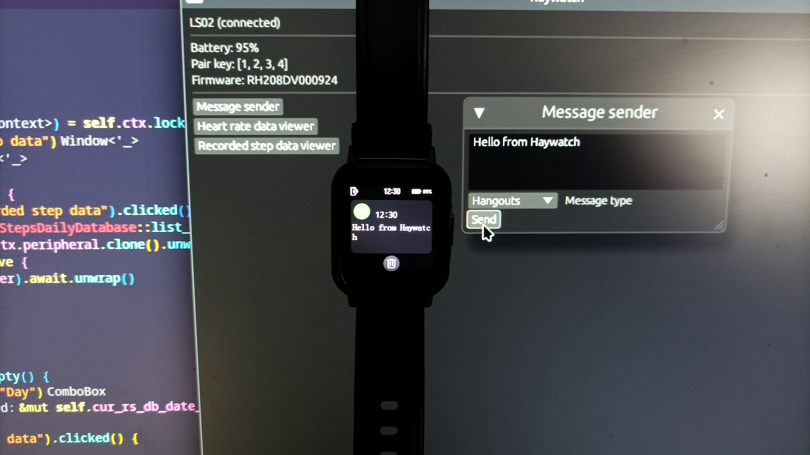

# Haywatch

> ## Haylou Smart Watch 2 (`LS02`) reverse-engineering project

Since nothing technical popped up about this watch model on the Internet (only the usual smart-watch articles and some apps), I decided to investigate and document it (its Bluetooth functionality) as deeply as I can.

This project contains the following:

- Documentation (work-in-progress) on reversed functionalities ([here](RE.md))

- Rust Bluetooth libraries implementing reversed functionalities ([`ls02` crate](ls02))

- Simple desktop Rust UI showcasing all this work and serving as an example for the libraries ([`haywatch` project](haywatch))

- Testing (dirty and quite unorganized) Rust command-line program, used to test/keep track of unknown watch requests/responses/etc, might also serve as an example for the libraries ([`ls02dev` program](ls02dev))
